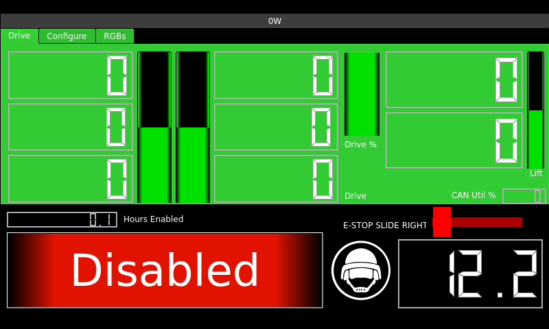
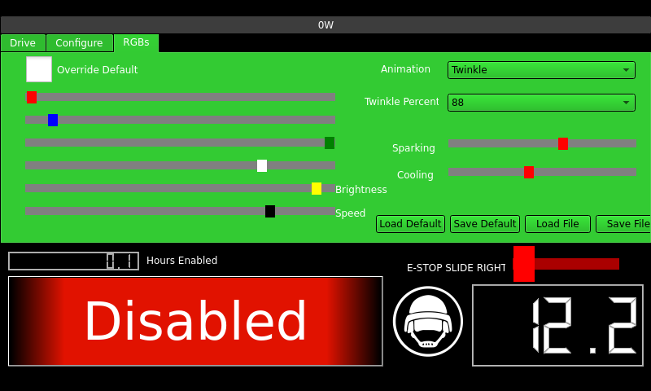
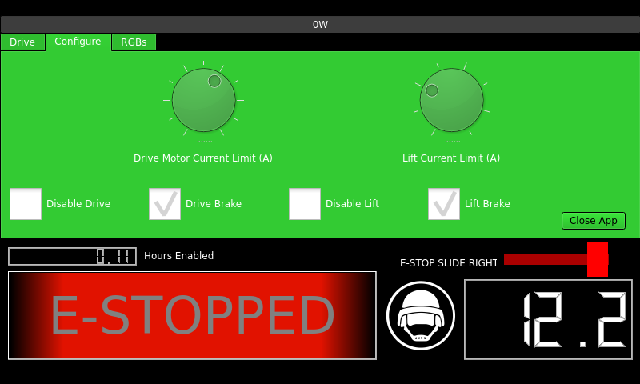
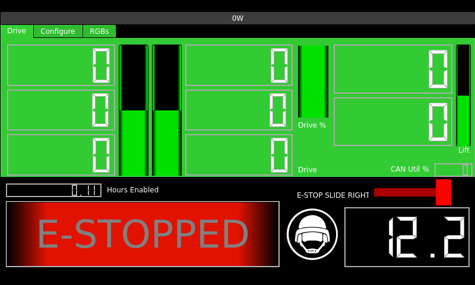

# 1806-RobotCart
Team 1806's Robot Cart Code. Runs on a Raspberry Pi 4B using the official touchscreen and touchscreen case, and uses a [DSD TECH SH-C31A](https://www.amazon.com/DSD-TECH-SH-C31A-Adapter-Support/dp/B0CDGD1FSH) for CAN communication.

# Features

## Touchscreen UI in QT

* UI built in QT Creator
* Phoenix code on separate thread

## Drive
* 6 TalonSRX drive intended to power 6 MiniCIMs using an old competition West Coast Drive 3 Motor shifting gearbox. High gear has been removed to allow for a physical method of disabling the drivetrain.
* Differential/CheesyDrive using a [Thrustmaster T16000M](https://www.thrustmaster.com/en-us/products/t-16000m-fcs/)
* Requires main trigger to be pulled to drive for an extra safety

#### *Cart Drivetrain is not for use at Official FRC Competitions and can be locked out both physically and in software*

## Lift
* 2 TalonSRX controlled lift table
* Controllable with up/down buttons to the left of the joystick on the T16000M controller.

## RGB
* RGB is used for enable disable signaling
* Can be overridden/customized for experimentation of demo purposes using the ui
#### 

## CAN Control
* All motors and RGBs are controlled using CTRE's Non-FRC Setup https://github.com/CrossTheRoadElec/Phoenix6-Documentation/blob/main/source/docs/installation/installation-nonfrc.rst
* CAN based control provides additional safety as our raspberry pi sends a heartbeat signal every tenth of a second, required to allow the motors to run.
* CAN based control allows for per-motor current readouts for operator diagnosis of mechanical or electrical issues.
* On the fly configurable current limits, and brake/cost mode
#### 
## Enable, Disable, and E-Stop
* Touch screen enable/disable button and E-stop slider that disables the cart and locks out the enable button.
#### 

## Control System is fully 24V compatible
* Maybe we'll tow our toolboxes with our cart.

# Future Ideas/Plans
* UI and phoenix code for modularly swapping out add-ons and assigning controls, such as code for a T-Shirt cannon or testing intakes by using our cart.
* Find a C++ library to talk to the Raspberry PI Servo hat in such a way we can have a servo-tester/mockup runner built into the cart.
* Make the UI prettier.
* Error/Mechanical failure detection
* Odometry and path planning?
* If we ever have more money than we know what to do with, swap all drive motors to Krakens.

